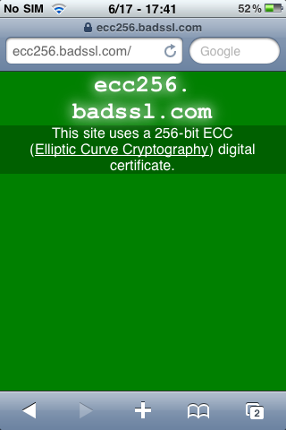
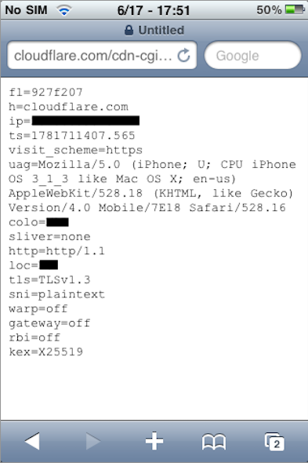
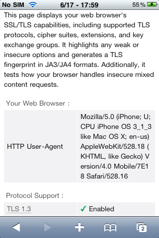

<h1>TLSFix</h1>
 
Modern SSL and TLS for iPhones, iPads, and iPod touches running iPhoneOS 2 to iOS 9.
 
 

  
  
  

 

TLSFix reroutes the device's TLS/SSL traffic and operations through OpenSSL 1.1.1, so an old device understands modern cryptography again, TLS 1.0 through 1.3, current ciphers (ChaCha20-Poly1305, AES-GCM), and certificates. The chain is verified by the device's **own system trust store**, additionally, it **does not** disrupt SSL pinning in any way, it handles the initial crypto talk, but the final decision wherther to accept the server cert is still up to the process.

## How it works

TLSFix works by keeping the real `SSLContextRef` valid (so any call it doesn't intercept still operates on a live object) and attaches an OpenSSL shadow keyed by that context. The shadow runs the real handshake and crypto, whjile CFNetwork keeps driving the socket through the `SSLReadFunc`/`SSLWriteFunc` it already installed, which TLSFix bridges into OpenSSL as a custom BIO.

Verification is the OS's job, as the chain received is rebuilt into a `SecTrustRef` and evaluated with `SecTrustEvaluate` against the live system/user trust store. **This eliminates the need to bundle external certificates, and any new added profiles/certificates via the settings app are reflected inmediately, without needing to restart anything**.

## Install

1. **Install the package**:
    - Install the DEB file from [releases](https://github.com/ObscureMosquito/TLSFix/releases) in your preferred manner

2. **Install modern roots**: 
    - Go to [tlsroot.litten.ca](https://tlsroot.litten.ca/) in the device you're installing, and install the certificate bundle, TLSFix still needs a modern trust store to verify against.

Restart all userspace processes, or reboot.

## Building from source

**Prerequisites**: Theos with the legacy SDKs, Xcode command-line
tools (`xcrun`, `clang`, `lipo`, `ld`), and `ldid`. The prebuilt OpenSSL (`src/openssl/`:
`lib/libssl.a`, `lib/libcrypto.a`, `include/`) is vendored.

Run `./build-legacy.sh`. It compiles `src/tlsfix_engine.c` and `src/tlsfix_hooks.c` and links each arch
against its SDK so `LC_VERSION_MIN`: armv6 and armv7 on the 5.1 SDK (min 2.0 / 3.0), arm64 on the 7.0 SDK (min 7.0).

Source layout:

- `src/tlsfix.h` — shared result codes, the per-connection `Shadow` struct, and the engine API.
- `src/tlsfix_engine.c` — the OpenSSL core: shadow table, the CFNetwork↔BIO bridge, system-trust
  verification, client-identity signing, and one-time setup.
- `src/tlsfix_hooks.c` — the Secure Transport hooks and the injection constructor.
- `src/tlsfix.plist` — the MobileSubstrate filter (which processes get injected).

### Note on Pinning and mutual TLS

- As stated before, when an app drives its own trust 
(SSL Pinning), TLSFix defers the decision completely, the app sees the real peer certificate via `SSLCopyPeerTrust` and decides whether to accept it. But the **connection itself is still handled by TLSFix**, it runs the modern handshake and crypto the legacy stack couldn't. So an app that both validates and pins still gets a connection that was impossible before, TLSFix only hands back the trust verdict, never the cipher.

- **Mutual TLS works** the same way (APNs, iMessage, and other client-certificate services). The client identity is signed through iOS `SecKeyRawSign` so the private key is never extracted, but the handshake carrying that identity is again TLSFix's modern one, so these services reach servers that now require a cipher the old stack can't speak.

## Credits

[nfzerox](https://github.com/nfzerox): Made the original tweak, and idea!

[ObscureMosquito](https://github.com/ObscureMosquito): Rewrote for OpenSSL, system trust store, SSL pinning, better legacy and system support!
